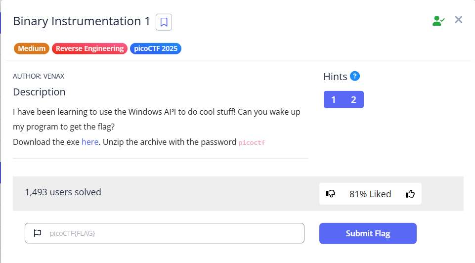

# [Binary Instrumentation 1] (Reverse Engineering / Medium)

## 問題の概要
- **目的**: exeファイルにflagを表示させる
- **配布物**:exeファイル

## 解法
1. exeファイルで呼び出されているAPIをトレース
2. SleepとSleepEXが呼び出されていることを確認
3. それら二つの第一引数に0をねじ込んで待機時間を0にして無理やり続きを実行させる
## 実行ログ
```
> python -m frida_tools.tracer -i "Sleep*" -i "NtDelayExecution" -i "WaitForSingleObject*" .\bininst1.exe
Instrumenting...
Hi, I have the flag for you just right here!
I'll just take a quick nap before I print it out for you, should only take me a decade or so!
zzzzzzzz....
           /* TID 0x7a00 */
    26 ms  Sleep()
    26 ms     | Sleep()
    26 ms     |    | SleepEx()
    26 ms     |    |    | SleepEx()
```
"Sleep*"と"NtDelayExecution"と"WaitForSingleObject*"を監視対象としてWindows APIの呼び出しを追跡。
結果、Sleep()をSleepEX()が使われていることが確認できた。
### sleep.js
```
onEnter(log, args, state) {
    // 引数（ミリ秒）を取得
    var ms = args[0].toInt32();
    log("Sleep called with: " + ms + "ms. Setting to 0...");
    
    // 待ち時間を0ミリ秒に書き換え
    args[0] = ptr(0);
  }
```
### sleepEx.js
```
defineHandler({
  onEnter(log, args, state) {
    log("SleepEx intercepted! Forcing 0ms...");
    args[0] = ptr(0); 
  },

  onLeave(log, retval, state) {
  }
});

```
### flag発見
```
> python -m frida_tools.tracer -i "Sleep*" -i "NtDelayExecution" -i "WaitForSingleObject*" .\bininst1.exe

Instrumenting...

Hi, I have the flag for you just right here!

I'll just take a quick nap before I print it out for you, should only take me a decade or so!

zzzzzzzz....

Ok, I'm Up! The flag is: cGljb0NURnt3NGtlX20zX3VwX3cxdGhfZnIxZGFfZjI3YWNjMzh9

           /* TID 0x78e8 */

    20 ms  Sleep intercepted! Forcing 0ms...

    20 ms     | Sleep intercepted! Forcing 0ms...

    20 ms     |    | SleepEx intercepted! Forcing 0ms...

    20 ms     |    |    | SleepEx intercepted! Forcing 0ms...

    20 ms  Sleep intercepted! Forcing 0ms...

    20 ms     | Sleep intercepted! Forcing 0ms...

    20 ms     |    | SleepEx intercepted! Forcing 0ms...

    20 ms     |    |    | SleepEx intercepted! Forcing 0ms...

    20 ms  Sleep intercepted! Forcing 0ms...

    20 ms     | Sleep intercepted! Forcing 0ms...

    20 ms     |    | SleepEx intercepted! Forcing 0ms...

    20 ms     |    |    | SleepEx intercepted! Forcing 0ms...

   (以下省略)
```
### flag
cGljb0NURnt3NGtlX20zX3VwX3cxdGhfZnIxZGFfZjI3YWNjMzh9をBase64でデコード
```
picoCTF{w4ke_m3_up_w1th_fr1da_f27acc38}
```
## 使用したツール・コマンド
- frida
- dencode
## 学び・沼った所
Fridaを使う際に大事な事
1. 関数の仕様・定義を確認する(引数など)
2. Fridaの文法に従って関数をいじる
3. onEnter(引数の操作)とonLeave(戻り値の操作)を区別する