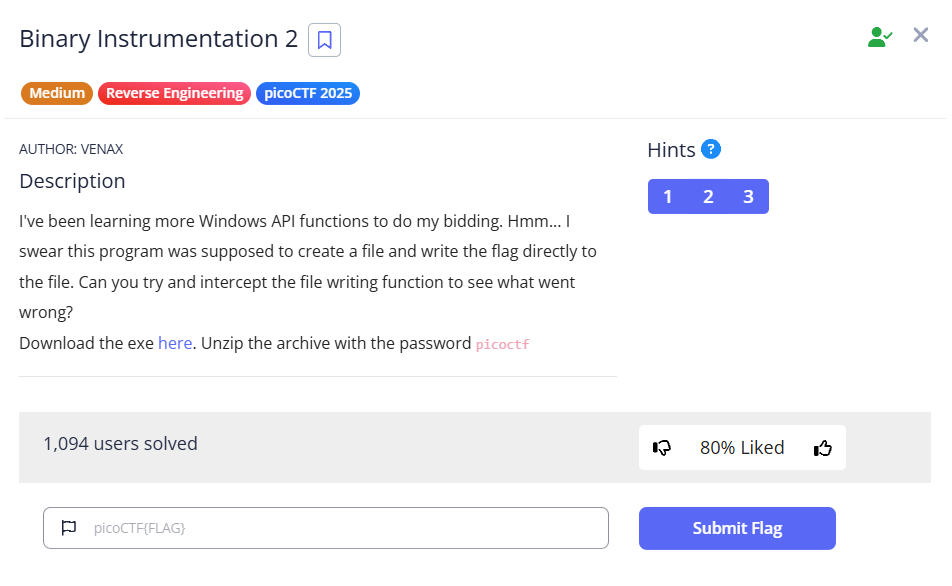

# [Binary Instrumentation 2] (Reverse Engineering / Medium)

## 問題の概要
- **目的**: exeファイルのファイル操作を追跡してflagを取得
- **配布物**: exeファイル

## 解法
1. CreateFileA()が呼び出されていることを確認
2. CreateFileA()の第一引数が不正なのでFridaで代入
3. CreateFIleA()が正常に動作したことによってWriteFile()が呼び出されるようになる
4. WriteFile()の第二引数に書き込むデータが格納されているアドレスが入るのでexeファイル実行と同時に第二引数を参照して中身をダンプ

(CreateFileA()とWriteFile()の細かい仕様まではここで説明しないのでMicrosoftの公式ドキュメントを参照してください)
- CreateFileA()
https://learn.microsoft.com/ja-jp/windows/win32/api/fileapi/nf-fileapi-createfilea
- WriteFile()
https://learn.microsoft.com/ja-jp/windows/win32/api/fileapi/nf-fileapi-writefile
## 実行ログ
### ProcessMonitor(CreateFileのログ)(一部省略)
```
Thread:	16116
Class:	File System
Operation:	CreateFile
Result:	NAME INVALID
Path:	C:\Users\[username]\Downloads\bininst2\<Insert path here>
Duration:	0.0000476
Desired Access:	Generic Write, Read Attributes
Disposition:	OverwriteIf
Options:	Synchronous IO Non-Alert, Non-Directory File
Attributes:	N
ShareMode:	None
AllocationSize:	0
```
CreateFileのファイル生成先のパスが不完全
### CreateFilaA.js
```js
defineHandler({
onEnter(log, args, state) {
    // args[0] はファイル名へのポインタ。readAnsiString() で実体化する
    var path = args[0].readAnsiString();
    const newFileName = 'flag.txt';
            this.newPathPtr = Memory.allocAnsiString(newFileName);

            // 2. 第一引数 (args[0]) を新しいポインタに差し替える
            args[0] = this.newPathPtr;
  },

  onLeave(log, retval, state) {
    var result = retval.toString();
    log(result);
  }
});
```
Insert path hereといわれたのでFridaから第一引数(lpFileName)にflag.txtを代入してパスを指定
### Fridaログ
```
           /* TID 0x52d0 */
    45 ms  CreateFileA()
    45 ms  0x2bc
    45 ms  WriteFile()
    45 ms     | WriteFile()
    45 ms     | 700 1073750640 0 0 0
```
第三引数(nNumberOfBytesToWrite)が0なのでnull書き込み操作となる。つまりflag.txtに書き込んでもらえない
### WriteFile.js
```js
/*
 * Auto-generated by Frida. Please modify to match the signature of WriteFile.
 * This stub is currently auto-generated from manpages when available.
 *
 * For full API reference, see: https://frida.re/docs/javascript-api/
 */

/*defineHandler({
  onEnter(log, args, state) {
    log('WriteFile()');
    var ms0 = args[0].toInt32();
    var ms1 = args[1].toInt32();
    var ms2 = args[2].toInt32();
    var ms3 = args[3].toInt32();
    var ms4 = args[4].toInt32();
    log(ms0 +' '+ ms1 +' '+ ms2 +' '+ ms3 +' '+ ms4);
  },
  onEnter: function (args) {
        const buffer = args[1];
        // サイズが0でも、念のため付近のメモリ(16バイト分など)を確認
        console.log('[*] WriteFile Buffer Address:', buffer);
        try {
            console.log(hexdump(buffer, { offset: 0, length: 16, header: true, ANSI: true }));
        } catch (e) {
            console.log('[-] Could not read memory at this address');
        }
    },

  onLeave(log, retval, state) {
  }
}); */
defineHandler({
  onEnter(log, args, state) {
    const buffer = args[1];
    const dumpLength = 256; // ここを好きな数値に変更してください

    log('[*] WriteFile Buffer Address: ' + buffer);

    try {
      log(hexdump(buffer, {
        offset: 0,
        length: dumpLength,
        header: true,
        ANSI: true
      }));
    } catch (e) {
      log('[-] Could not read memory at this address');
    }
  },

  onLeave(log, retval, state) {
  }
});

```
コメントアウトしている上側のスクリプトはWriteFile()の引数を表示する用のスクリプト。 \
下側のスクリプトでWriteFile()に書き込まれる(はずだった)データをダンプ。
### WriteFile.js(別解)
```js
defineHandler({
onEnter(log, args, state) {
    
        args[2] = ptr(128); 
        log('[!] Forced WriteFile size to 256 bytes');
},

  onLeave(log, retval, state) {
  }
});
```
後から気づきましたが、第三引数を直接いじってflag.txtに書き込ませればよかった。 \
絶対こっちのほうがスマート
#### flag.txtの中身
```
cGljb0NURntmcjFkYV9mMHJfYjFuX2luNXRydW0zbnQ0dGlvbiFfYjIxYWVmMzl9
```
### flag
```
           /* TID 0x27dc */
    51 ms  CreateFileA()
    52 ms  0x2b4
    52 ms  WriteFile()
    52 ms     | [*] WriteFile Buffer Address: 0x140002270
    52 ms     |             0  1  2  3  4  5  6  7  8  9  A  B  C  D  E  F  0123456789ABCDEF
140002270  63 47 6c 6a 62 30 4e 55 52 6e 74 6d 63 6a 46 6b  cGljb0NURntmcjFk
140002280  59 56 39 6d 4d 48 4a 66 59 6a 46 75 58 32 6c 75  YV9mMHJfYjFuX2lu
140002290  4e 58 52 79 64 57 30 7a 62 6e 51 30 64 47 6c 76  NXRydW0zbnQ0dGlv
1400022a0  62 69 46 66 59 6a 49 78 59 57 56 6d 4d 7a 6c 39  biFfYjIxYWVmMzl9
1400022b0  00 00 00 00 00 00 00 00 00 00 00 00 00 00 00 00  ................
1400022c0  40 01 00 00 00 00 00 00 00 00 00 00 00 00 00 00  @...............
1400022d0  00 00 00 00 00 00 00 00 00 00 00 00 00 00 00 00  ................
1400022e0  00 00 00 00 00 00 00 00 00 00 00 00 00 00 00 00  ................
1400022f0  00 00 00 00 00 00 00 00 00 00 00 00 00 00 00 00  ................
140002300  00 00 00 00 00 00 00 00 00 00 00 00 00 00 00 00  ................
140002310  00 00 00 00 00 00 00 00 00 30 00 40 01 00 00 00  .........0.@....
140002320  00 00 00 00 00 00 00 00 00 00 00 00 00 00 00 00  ................
140002330  a0 21 00 40 01 00 00 00 b0 21 00 40 01 00 00 00  .!.@.....!.@....
140002340  00 00 00 00 00 00 00 00 00 00 00 00 00 00 00 00  ................
140002350  00 01 00 00 00 00 00 00 00 00 00 00 00 00 00 00  ................
140002360  00 00 00 00 00 00 00 00 00 00 00 00 00 00 00 00  ................
```

```
cGljb0NURntmcjFkYV9mMHJfYjFuX2luNXRydW0zbnQ0dGlvbiFfYjIxYWVmMzl9
```
現れた文字列をBase64でデコード
```
picoCTF{fr1da_f0r_b1n_in5trum3nt4tion!_b21aef39}
```

## 使用したツール・コマンド
- Frida
- VSCode
- Dencode

## 学び・沼った所
- CreateFileA()が呼び出されていることを見つけるまではよかったけどそのあとで沼った。ProcessMonitorのおかげでpathが不完全なことに気づけた。
- メモリ内のデータをダンプするコードがわからなくてそこでGeminiをつかっちゃったけど、第三引数をいじる方法を早く思いついていれば自力で解けたなと思う。
