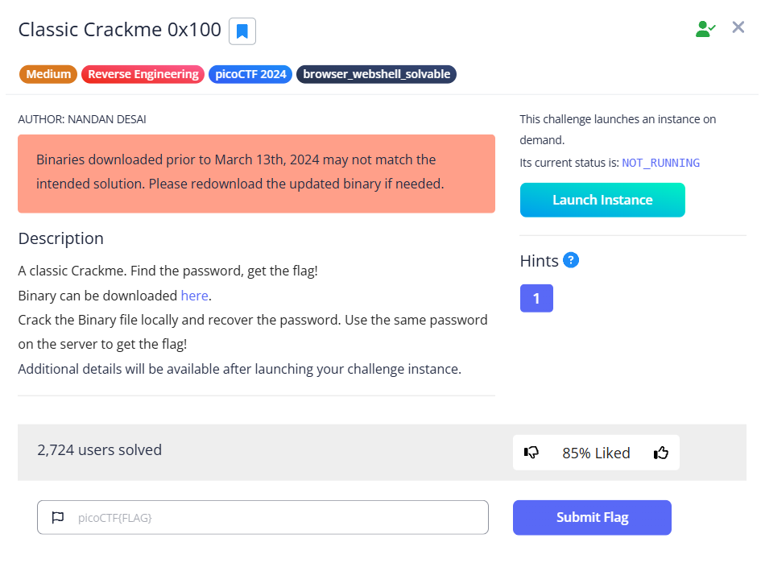

# [Classic Crackme 0x100] (Reverse Engineering / Medium)

## 問題の概要
- **目的**: 配布されたELFファイルのパスワードを見つける
- **配布物**: ELFファイル

## 解法
1. ELFファイルをデコンパイル
2. それを元にパスワードを逆算
## 実行ログ
### 配布ファイルのデコンパイル結果
```c
int main(void)

{
  uint A;
  int B;
  size_t len_of_output;
  char input [51];
  char output [51];
  int random2;
  int random1;
  char fix;
  int secret3;
  int secret2;
  int secret1;
  int len;
  int j;
  int i;
  
  builtin_strncpy(output,"qhcpgbpuwbaggepulhstxbwowawfgrkzjstccbnbshekpgllze",0x33);
  setvbuf(stdout,(char *)0x0,2,0);
  printf("Enter the secret password: ");
  __isoc99_scanf(&DAT_00402024,input);
  i = 0;
  len_of_output = strlen(output);
  for (; i < 3; i = i + 1) {
    for (j = 0; j < (int)len_of_output; j = j + 1) {
      A = (j % 0xff >> 1 & 0x55U) + (j % 0xff & 0x55U);
      A = ((int)A >> 2 & 0x33U) + (A & 0x33);
      B = ((int)A >> 4) + input[j] + -0x61 + (A & 0xf);
      input[j] = (char)B + (char)(B / 0x1a) * -0x1a + 'a';
    }
  }
  B = memcmp(input,output,(long)(int)len_of_output);
  if (B == 0) {
    printf("SUCCESS! Here is your flag: %s\n","picoCTF{sample_flag}");
  }
  else {
    puts("FAILED!");
  }
  return 0;
}
```
### 暗号化部分
```C
  len_of_output = strlen(output);
  for (int i = 0; i < 3; i++) {
    for (int j = 0; j < (int)len_of_output; j++) {
      A = (j >> 1 & 0x55U) + (j & 0x55U);
      A = ((int)A >> 2 & 0x33U) + (A & 0x33);
      B = ((int)A >> 4) + input[j] - 0x61 + (A & 0xf);
      input[j] = (char)B + (char)(B / 0x1a) * -0x1a + 'a';
    }
  }
```
### 復元に使ったpythonソースコード
```py
output = "qhcpgbpuwbaggepulhstxbwowawfgrkzjstccbnbshekpgllze"
input_len = len(output)
original_input = ""

for j in range(input_len):
    # Aの計算（jに依存する定数）
    a = (j >> 1 & 0x55) + (j & 0x55)
    a = (a >> 2 & 0x33) + (a & 0x33)
    
    # 'a'から'z'まで全部試す
    for char_code in range(ord('a'), ord('z') + 1):
        temp_char = char_code
        
        # 3回処理をシミュレート
        for i in range(3):
            # C言語の (int)A >> 4 は、今回の A の範囲ならほぼ 0 ですが念のため再現
            b = (a >> 4) + temp_char - 0x61 + (a & 0xf)
            temp_char = (b % 26) + ord('a')
            
        # 3回後の結果が output[j] と一致したらそれが正解！
        if chr(temp_char) == output[j]:
            original_input += chr(char_code)
            break

print("Found input:", original_input)
```
### C++版
```cpp
#include <bits/stdc++.h>
using namespace std;

int main() {
  string output = "qhcpgbpuwbaggepulhstxbwowawfgrkzjstccbnbshekpgllze";
  char input[128] = {0};
  char answer[128] = {0};
  int A = 0;
  int B = 0;
  for (int j = 0; j < output.size(); j++) {
    for (int k = 0; k < 26; k++) {
      input[j] = 'a' + k;
      for (int i = 0; i < 3; i++) {
        A = (j % 0xff >> 1 & 0x55U) + (j % 0xff & 0x55U);
        A = ((int)A >> 2 & 0x33U) + (A & 0x33);
        B = ((int)A >> 4) + input[j] + -0x61 + (A & 0xf);
        input[j] = (char)B + (char)(B / 0x1a) * -0x1a + 'a';
      }
      if (input[j] == output[j]) {
        answer[j] = 'a' + k;
      }
    }
  }
  cout << answer << endl;
  return 0;
}

```
### flag
Password
```
qezjdvjltvuxavgiibmkrsncqrntxfykgmntwsepmyvyguzwtv
```
Flag
```
picoCTF{s0lv3_angry_symb0ls_4699696e}
```
## 使用したツール・コマンド
- ghidra
## 学び・沼った所
```c
(char)B + (char)(B / 0x1a) * -0x1a
```
↑これはB % 26と同じ意味
頑張ってコードを全部解読して逆算しようとしたけどアルファベット小文字の総当たりをしたほうが早い。pythonコードはgeminiに書いてもらった。C++はそれを元に記述。これくらいはパっと思いついて書けるようにならないとなと思った。
