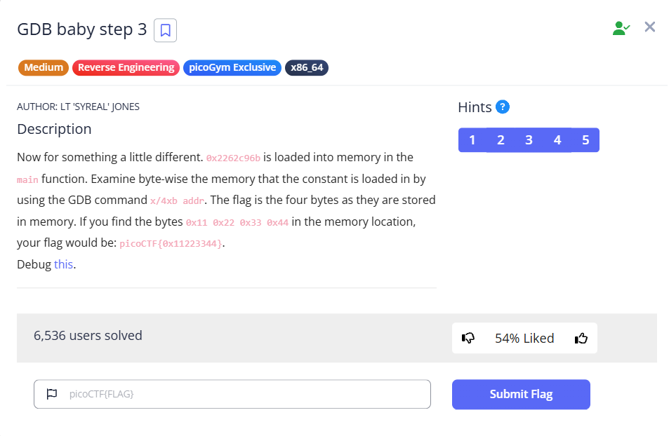

# [GDB baby step 3] (Reverse Engineering / Medium)

## 問題の概要
- **目的**: 0x2262c96bの格納されているアドレスをGDBで確認し、どのように格納されているかを確認する問題
- **配布物**: ELFファイル

## 解法
1. gdbにてmain関数にbraekpointを設置
2. そこからコマンド"x/32xb"などでバイナリを列挙し、0x2262c96bが格納されている場所を確認
## 実行ログ
```
(gdb) x/32xb main
0x401106 <main>:        0xf3    0x0f    0x1e    0xfa    0x55    0x48    0x89    0xe5
0x40110e <main+8>:      0x89    0x7d    0xec    0x48    0x89    0x75    0xe0    0xc7
0x401116 <main+16>:     0x45    0xfc    0x6b    0xc9    0x62    0x22    0x8b    0x45
0x40111e <main+24>:     0xfc    0x5d    0xc3    0x66    0x2e    0x0f    0x1f    0x84
```

## 使用したツール・コマンド
- gdb
## 学び・沼った所
リトルエンディアンを学ぶことに焦点を当てた問題。 \
正直難易度はmediumではなくeasyレベルかな