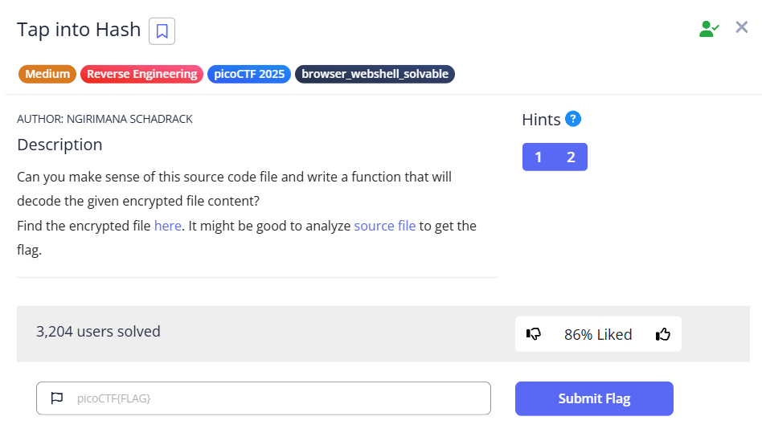

# [Tap into Hash] (Reverse Engineering / Medium)

## 問題の概要
- **目的**: Pythonスクリプトによって暗号化された文字列の復号
- **配布物**: Pythonソースコード, エンコード結果
## 解法
1. 唯一情報がないtoken変数を探す

## 配布ファイル
以下配布された.pyファイル内の重要な部分を表記。

### main
(変数keyは配布ファイル内に表記されているため変更済み)
```py
def main(token : str):
    key = b'\xa9\xcco`\xfa\xf9\xb5\xc0\xda\xf6*\xb3\xbe\xa9t\x0fi\xae\x13\x01q-\xae\x9ap\xb7\xa45\x1e{\xaa\xb4'

    print("Key:", key)

    genesis_block = Block(0, "0", int(time.time()), "EncodedGenesisBlock", 0)
    blockchain = [genesis_block]

    for i in range(1, 5):
        encoded_transactions = base64.b64encode(
            f"Transaction_{i}".encode()).decode('utf-8')
        # "Transaction_1" ~ "Transaction_4"をbase64にencode
        new_block = proof_of_work(blockchain[-1], encoded_transactions)
        blockchain.append(new_block)

    # all_blocks = get_all_blocks(blockchain)

    blockchain_string = blockchain_to_string(blockchain)
    encrypted_blockchain = encrypt(blockchain_string, token, key)

    print("Encrypted Blockchain:", encrypted_blockchain)
```
### encrypt
```py
def encrypt(plaintext : str, inner_txt : str, key : bytes) -> bytes:
    midpoint = len(plaintext) // 2

    first_part = plaintext[:midpoint]
    second_part = plaintext[midpoint:]
    modified_plaintext = first_part + inner_txt + second_part
    block_size : int = 16
     
    plaintext1 = pad(modified_plaintext, block_size)
    key_hash = hashlib.sha256(key).digest()

    ciphertext = b''

    for i in range(0, len(plaintext1), block_size):
        block = plaintext1[i:i + block_size]
        cipher_block = xor_bytes(block, key_hash)
        ciphertext += cipher_block

    return ciphertext
```
### xor
```py
def xor_bytes(a : bytes, b : bytes) -> bytes:
    return bytes(x ^ y for x, y in zip(a, b))
```
## 暗号化のプロセス
### 1. 文字列plaintextの中心の位置にtoken(inner_txt)を埋め込む
#### encryptの一部
```py
    midpoint = len(plaintext) // 2

    first_part = plaintext[:midpoint]
    second_part = plaintext[midpoint:]
    modified_plaintext = first_part + inner_txt + second_part
```

### 2. modified_plaintextの末尾をパディング
#### pad
```py
def pad(data : str, block_size : int ): # 今回はblock_sizeは16
    # dataのデータ長を16の倍数にするためにあと何バイト必要か計算
    padding_length = block_size - len(data) % block_size
    # "足りないバイト数の値"を足りない分だけ並べる 例) 3バイト足りないなら\x03\x03\x03が末尾に並ぶ
    padding = bytes([padding_length] * padding_length)
    return data.encode() + padding
```
## 実行ログ

## 使用したツール・コマンド

## 学び・沼った所
- 今回の暗号化で使われたパディングはPKCS#7 Paddingと呼ばれる方式。
