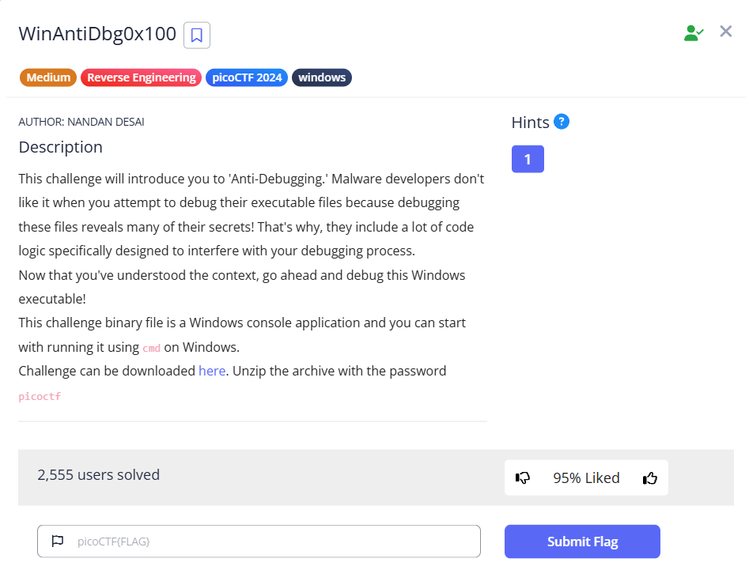

# [WinAntiDbg0x100] (Reverse Engineering / Medium)

## 問題の概要
- **目的**:exeファイルのデバック検知を無効化
- **配布物**:exeファイル

## 解法
1. exeファイルを実行->デバッカーを使用して実行するように指示される
2. デバッカーを使用してexeファイルを実行->デバック検知をかいくぐってFlagを入手するように指示される
3. PEBのBeingDebuggedフラグを1(True)から0(False)に変更して実行
## 実行ログ
### powershell
```
PS C:\Users\myoum\Downloads\WinAntiDbg0x100> .\WinAntiDbg0x100.exe


        _            _____ _______ ______
       (_)          / ____|__   __|  ____|
  _ __  _  ___ ___ | |       | |  | |__
 | '_ \| |/ __/ _ \| |       | |  |  __|
 | |_) | | (_| (_) | |____   | |  | |
 | .__/|_|\___\___/ \_____|  |_|  |_|
 | |
 |_|
  Welcome to the Anti-Debug challenge!
### To start the challenge, you'll need to first launch this program using a debugger!
```
### WinDbg
```
0:000> p


        _            _____ _______ ______  
       (_)          / ____|__   __|  ____| 
  _ __  _  ___ ___ | |       | |  | |__    
 | '_ \| |/ __/ _ \| |       | |  |  __|   
 | |_) | | (_| (_) | |____   | |  | |      
 | .__/|_|\___\___/ \_____|  |_|  |_|      
 | |                                       
 |_|                                       
  Welcome to the Anti-Debug challenge!
### Level 1: Why did the clever programmer become a gardener? Because they discovered their talent for growing a 'patch' of roses!
### Oops! The debugger was detected. Try to bypass this check to get the flag!
```
### WinDbg & デバック検知回避
#### PEBのBeingDebuggedを書き換えるコマンド
```
eb @$peb+2 0
```
- eb      : Edit Byte
- @$peb+2 : WinDbgは$peb変数にPEBの先頭アドレスを格納しており、@でアドレス値であることを明示。先頭から2バイト目がBeingDebugged。
- 0       : false

#### 実行結果
```
Value cannot be null. (Parameter 'command')0:000> eb @$peb+2 0
0:000> g


        _            _____ _______ ______  
       (_)          / ____|__   __|  ____| 
  _ __  _  ___ ___ | |       | |  | |__    
 | '_ \| |/ __/ _ \| |       | |  |  __|   
 | |_) | | (_| (_) | |____   | |  | |      
 | .__/|_|\___\___/ \_____|  |_|  |_|      
 | |                                       
 |_|                                       
  Welcome to the Anti-Debug challenge!
### Level 1: Why did the clever programmer become a gardener? Because they discovered their talent for growing a 'patch' of roses!
### Good job! Here's your flag:
### ~~~ picoCTF{d3bug_f0r_th3_Win_0x100_e6c390e2}
### (Note: The flag could become corrupted if the process state is tampered with in any way.)


ModLoad: 72b20000 72b35000   C:\WINDOWS\SysWOW64\kernel.appcore.dll
ModLoad: 76f20000 76fe7000   C:\WINDOWS\SysWOW64\msvcrt.dll
eax=00000000 ebx=778b7240 ecx=00000004 edx=00000000 esi=00000000 edi=00000000
eip=777f91fc esp=0093f7ac ebp=0093f880 iopl=0         nv up ei pl nz na pe nc
cs=0023  ss=002b  ds=002b  es=002b  fs=0053  gs=002b             efl=00000206
ntdll!NtTerminateProcess+0xc:
777f91fc c20800          ret     8

```
## 使用したツール・コマンド
- WinDbg
## 学び・沼った所
- PEB構造体(Process Environment Block)はWindowsで動作するプロセスが持つ、OSが参照するためのデータ。

以下Microsoft公式ドキュメントより
```C
typedef struct _PEB {
  BYTE                          Reserved1[2];
  BYTE                          BeingDebugged;
  BYTE                          Reserved2[1];
  PVOID                         Reserved3[2];
  PPEB_LDR_DATA                 Ldr;
  PRTL_USER_PROCESS_PARAMETERS  ProcessParameters;
  PVOID                         Reserved4[3];
  PVOID                         AtlThunkSListPtr;
  PVOID                         Reserved5;
  ULONG                         Reserved6;
  PVOID                         Reserved7;
  ULONG                         Reserved8;
  ULONG                         AtlThunkSListPtr32;
  PVOID                         Reserved9[45];
  BYTE                          Reserved10[96];
  PPS_POST_PROCESS_INIT_ROUTINE PostProcessInitRoutine;
  BYTE                          Reserved11[128];
  PVOID                         Reserved12[1];
  ULONG                         SessionId;
} PEB, *PPEB;
```

今回のexeファイル(WinAntiDbg0x100)のPEB構造体
```
0:000> dt nt!_PEB
ntdll!_PEB
   +0x000 InheritedAddressSpace : UChar
   +0x001 ReadImageFileExecOptions : UChar
   +0x002 BeingDebugged    : UChar
   +0x003 BitField         : UChar
   +0x003 ImageUsesLargePages : Pos 0, 1 Bit
   +0x003 IsProtectedProcess : Pos 1, 1 Bit
   +0x003 IsImageDynamicallyRelocated : Pos 2, 1 Bit
   +0x003 SkipPatchingUser32Forwarders : Pos 3, 1 Bit
   +0x003 IsPackagedProcess : Pos 4, 1 Bit
   +0x003 IsAppContainer   : Pos 5, 1 Bit
   +0x003 IsProtectedProcessLight : Pos 6, 1 Bit
   +0x003 IsLongPathAwareProcess : Pos 7, 1 Bit
   +0x004 Mutant           : Ptr32 Void
   +0x008 ImageBaseAddress : Ptr32 Void
   +0x00c Ldr              : Ptr32 _PEB_LDR_DATA
   +0x010 ProcessParameters : Ptr32 _RTL_USER_PROCESS_PARAMETERS
   +0x014 SubSystemData    : Ptr32 Void
   (以下省略)
```
データの中身
```
0:000> dx @$peb
@$peb                 : 0x238000 [Type: _PEB *]
    [+0x000] InheritedAddressSpace : 0x0 [Type: unsigned char]
    [+0x001] ReadImageFileExecOptions : 0x0 [Type: unsigned char]
    [+0x002] BeingDebugged    : 0x1 [Type: unsigned char]
    [+0x003] BitField         : 0x4 [Type: unsigned char]
    [+0x003 ( 0: 0)] ImageUsesLargePages : 0x0 [Type: unsigned char]
    [+0x003 ( 1: 1)] IsProtectedProcess : 0x0 [Type: unsigned char]
    [+0x003 ( 2: 2)] IsImageDynamicallyRelocated : 0x1 [Type: unsigned char]
    [+0x003 ( 3: 3)] SkipPatchingUser32Forwarders : 0x0 [Type: unsigned char]
    [+0x003 ( 4: 4)] IsPackagedProcess : 0x0 [Type: unsigned char]
    [+0x003 ( 5: 5)] IsAppContainer   : 0x0 [Type: unsigned char]
    [+0x003 ( 6: 6)] IsProtectedProcessLight : 0x0 [Type: unsigned char]
    [+0x003 ( 7: 7)] IsLongPathAwareProcess : 0x0 [Type: unsigned char]
    [+0x004] Mutant           : 0xffffffff [Type: void *]
    [+0x008] ImageBaseAddress : 0x1e0000 [Type: void *]
    [+0x00c] Ldr              : 0x77e87340 [Type: _PEB_LDR_DATA *]
    [+0x010] ProcessParameters : 0x9733e8 [Type: _RTL_USER_PROCESS_PARAMETERS *]
    [+0x014] SubSystemData    : 0x0 [Type: void *]
    (以下省略)
```
